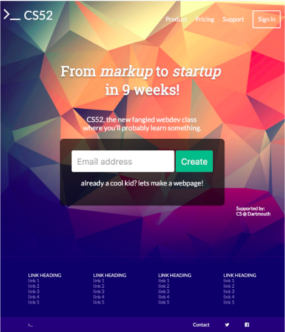
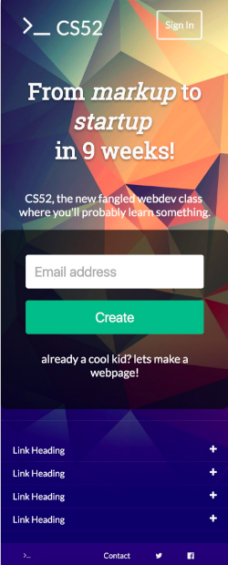
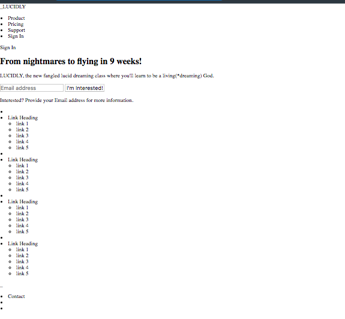
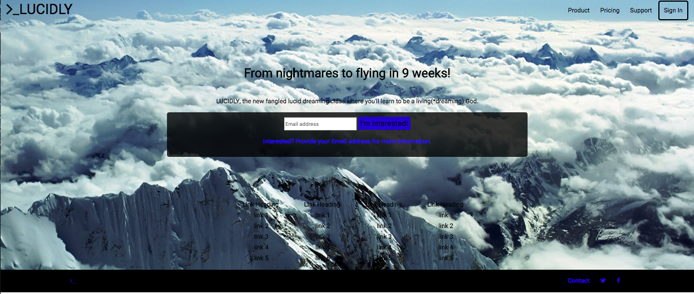
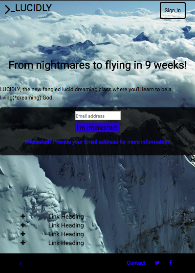

# Lab 1: Landing page
## Alex Bailey

###
I created a landing page, alexandergbailey.github.io/lab1/, which acts as a sign-up page for a hypothetical lucid-dreaming class. When the screen width is smaller than 920px, the right header options collapse into just one 'sign-in' option, the input and button stack on top of each other while the black opaque backround stretches the width of the screen, and the lists collapse. I modeled this landing page exactly as the example shown in the lab1 description. Images of the full example page and the small-width example page respectively are shown below.

### The layout stage is shown below. This is the setup of the html without CSS.

### Finally, screenshots of my full landing page and small-width version respectively.

### Summary of full to small-width transitions:
#### In the header: The title in the left corner shrinks so everything can fit even at the smallest width, the items in the right of the header disappear except for 'sign in'.
#### In the shadow box: The shadow box takes up the full screen width, while the input and button stack on top of each other. Input shrinks to the width of the button for aesthetic purposes.
#### In the lists: the lists shrink into just the titles, with a plus that could hypothetically be clicked to expand a given list.
